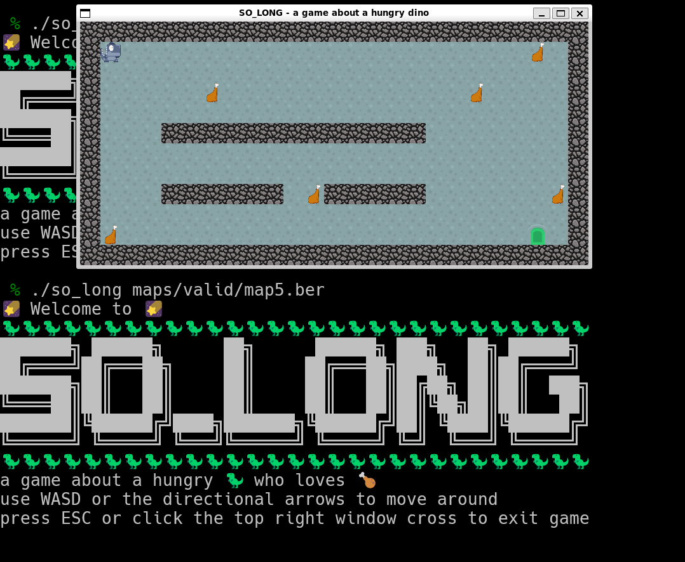

*This project has been created as part of the 42 curriculum by pafroidu.*




## Description

So Long is our introduction to graphical programming in C. This project challenges us to create a small 2D game using the MiniLibX graphics library, where we learn the fundamentals of window management, event handling, image rendering, and game loop implementation.

The goal is to build a simple game where a player character must collect all collectibles on a map and reach the exit. The game features sprite-based graphics, keyboard controls, and collision detection. This project teaches us how graphical applications work at a low level and prepares us for more complex graphical projects.

Key learning objectives:
- **MiniLibX**: Understanding the school's simple graphics library
- **Window management**: Creating windows, handling events, and rendering frames
- **Sprite rendering**: Loading and displaying XPM images as textures
- **Game loop**: Implementing a continuous rendering and event handling cycle
- **Map parsing**: Reading and validating game maps from .ber files
- **Collision detection**: Implementing basic game physics and boundaries
- **Event handling**: Responding to keyboard input for player movement

## Instructions

### Compilation

The project includes a Makefile with standard rules:

```bash
make        # Compiles the game (so_long)
make clean  # Removes object files
make fclean # Removes object files and executable
make re     # Recompiles everything
```

**Note:** The bonus part (animations, enemies, on-screen move counter) is not implemented in this version.

### Compilation Flags

All source files must compile with:
```bash
cc -Wall -Wextra -Werror
```

You must link with the MiniLibX library (already well linked in the makefile if you use the command `make`):
```bash
cc -Wall -Wextra -Werror *.c -Lmlx -lmlx -framework OpenGL -framework AppKit  # macOS
cc -Wall -Wextra -Werror *.c -Lmlx_linux -lmlx_linux -lXext -lX11            # Linux
```

### External Functions Allowed

- `open`, `close`, `read`, `write`
- `malloc`, `free`
- `perror`, `strerror`
- `exit`
- All functions from the **MiniLibX** library
- `ft_printf` and your libft functions

### Program Usage

```bash
./so_long map.ber
```

The program takes a map file as argument (with `.ber` extension) and displays the game window.

### Map Format

Maps are stored in `.ber` files with the following characters:

| Character | Description |
|-----------|-------------|
| `0` | Empty space (walkable) |
| `1` | Wall (collision) |
| `C` | Collectible item |
| `E` | Exit (reachable after collecting all C) |
| `P` | Player starting position |

**Map Rules:**
- Map must be rectangular (all lines same length)
- Map must be surrounded by walls (`1`)
- Must contain exactly **1 exit** (`E`)
- Must contain exactly **1 player** starting position (`P`)
- Must contain **at least 1 collectible** (`C`)
- Must have a valid path from player to all collectibles and exit

**Example Map (maps/simple.ber):**
```
1111111111111
10010000000C1
1000011111001
1P0011E000001
1111111111111
```

### Controls

- **W** or **↑**: Move up
- **A** or **←**: Move left
- **S** or **↓**: Move down
- **D** or **→**: Move right
- **ESC** or **close window**: Exit game

### Game Rules

1. Player moves one tile at a time using WASD keys
2. Player cannot walk through walls (`1`)
3. Player collects items (`C`) by walking over them
4. Exit (`E`) opens only after collecting all collectibles
5. Game displays move count in terminal (increments with each move)
6. Game ends when player reaches exit with all collectibles

### Mandatory Requirements

- **Graphics**: Use MiniLibX to display game window
- **Textures**: Display walls, collectibles, player, and exit with different textures/colors
- **Keyboard input**: Handle W/A/S/D (or arrow keys) for movement
- **Move counter**: Display number of moves in shell (printed each move)
- **Map validation**: Check map validity and display error for invalid maps
- **Collision**: Player cannot walk through walls
- **Exit condition**: Exit only accessible after collecting all collectibles
- **Clean exit**: ESC key and window close button must properly exit program
- **Error handling**: Handle all errors (invalid map, missing file, texture loading failure, etc.)

### Project Structure

The codebase is organized into a clean modular architecture:

**Source Files** :

```
srcs/
├── main.c                              # Entry point and game launcher
│
├── cleanup_error/                      # Error handling and cleanup
│   ├── cleanup_map_structure.c        # Free map resources
│   └── error_print_message.c          # Error message display
│
├── maps/                               # Map parsing and validation
│   ├── map_check_file_extension.c     # Validate .ber extension
│   ├── map_handle_full_parsing.c      # Main parsing orchestrator
│   ├── map_list_to_grid.c             # Convert list to 2D array
│   ├── map_to_list_parser.c           # Parse map lines
│   ├── map_to_list_reader.c           # Read file with get_next_line
│   ├── map_to_list_utils.c            # Parsing utilities
│   ├── map_to_list_utils2.c           # Additional parsing utilities
│   ├── map_validate_letters.c         # Validate map characters
│   ├── map_validate_path.c            # Flood fill path validation
│   └── map_validate_walls.c           # Wall boundary checking
│
├── game/                               # Game logic and initialization
│   ├── game_init.c                    # MiniLibX initialization
│   ├── game_handle_screen_data.c      # Screen size validation
│   ├── game_handle_gameplay.c         # Gameplay state management
│   ├── game_handle_keys.c             # Keyboard input handling
│   └── game_print_ASCII_art.c         # Terminal decorations
│
└── render/                             # Graphics rendering
    ├── render_handle_load.c           # Texture loading orchestrator
    ├── render_load_utils.c            # Individual texture loaders
    └── render_mapping_to_the_grid.c   # Display sprites on map
```

**Dependencies:**
- **MiniLibX-Linux**: Graphics library (`minilibx-linux/`)
- **Superlib**: Custom utility library containing:
  - `libft` - String manipulation, memory, linked lists
  - `ft_printf` - Formatted output
  - `get_next_line` - File reading (used for map parsing)
  - `push_swap` utilities - Array operations

**Tile Size:** 32x32 pixels (defined in `game.h`)

**Assets Path:** `./assets/` directory for XPM sprite files

### Implementation Details

**Map Parsing Flow:**
1. Validate `.ber` file extension
2. Read map lines using `get_next_line()`
3. Store lines in a linked list
4. Validate map characters (0, 1, C, E, P only)
5. Check rectangular shape
6. Count elements: 1 player, 1 exit, ≥1 collectible
7. Verify walls surround the map
8. Convert list to 2D grid for flood fill
9. Use flood fill from player position to verify all collectibles and exit are reachable

**Graphics Rendering:**
- Loads XPM textures for each game element
- Renders entire map each frame in order: floor → walls → collectibles → exit → player
- Uses `mlx_put_image_to_window()` with 32px tile size
- Window size calculated: `map_width × 32` by `map_height × 32`

**Movement System:**
- Keyboard input handled via `mlx_hook()` for key press events
- WASD and arrow keys supported
- Collision detection checks grid position before moving
- Move counter increments only on successful moves (not wall collisions)
- Terminal output shows move count after each move

**Win Condition:**
- Exit becomes accessible only after `collectible_left == 0`
- Player must reach exit position with all collectibles gathered
- Game displays victory message and exits cleanly

### Bonus Features

**Status:** Bonus features (animations, enemies, on-screen counter) are not implemented in this version.

The bonus part would require:

#### On-Screen Move Counter
Displaying the move counter directly in the game window instead of (or in addition to) the shell.

#### Sprite Animation
Adding animated sprites for:
- Player movement (walking animation)
- Collectibles (idle animation, sparkles, rotation)
- Exit (opening animation when all collectibles are gathered)

#### Enemy Patrols
Adding enemy sprites that move on the map. Game ends (player loses) if the player touches an enemy.

Map character for enemies: `N` or `M` (choose one)

Example bonus map:
```
1111111111111
10010000000C1
100N011111001
1P0011E000N01
1111111111111
```

#### Additional Bonus Ideas
- Parallax backgrounds
- Multiple levels
- Health system with hearts
- Different enemy behaviors (patrol patterns)
- Particle effects (dust when moving, sparkles when collecting)

## Resources

### MiniLibX Documentation

- [MiniLibX Documentation (42 Docs)](https://harm-smits.github.io/42docs/libs/minilibx) - Comprehensive guide
- [MiniLibX Tutorial](https://github.com/qst0/ft_libgfx) - Getting started with MiniLibX
- [MiniLibX Events Guide](https://github.com/keuhdall/images_example) - Event handling examples

### MiniLibX Installation

**Linux:**
```bash
# Ubuntu/Debian
sudo apt-get install libx11-dev libxext-dev libbsd-dev

# Clone and compile MiniLibX
git clone https://github.com/42Paris/minilibx-linux.git mlx_linux
cd mlx_linux
make
```

**macOS:**
```bash
# MiniLibX is already available on 42 Macs
# Or download from:
# https://github.com/42Paris/minilibx-macos
```

### Graphics Programming

- [XPM File Format](https://en.wikipedia.org/wiki/X_PixMap) - Understanding texture format
- [Game Loop Pattern](https://gameprogrammingpatterns.com/game-loop.html) - Game programming patterns
- [2D Game Development Basics](https://www.redblobgames.com/) - Interactive tutorials

### Map Parsing and Validation

- [Flood Fill Algorithm](https://en.wikipedia.org/wiki/Flood_fill) - For map path validation
- [Reading Files in C](https://www.gnu.org/software/libc/manual/html_node/Opening-and-Closing-Files.html)

### Sprite Resources (Free to Use)

- [OpenGameArt.org](https://opengameart.org/) - Free game assets
- [itch.io Game Assets](https://itch.io/game-assets/free) - Free sprites and tilesets
- [Kenney.nl](https://kenney.nl/assets) - Free game assets (high quality)

### Testing

```bash
# Test with valid maps
./so_long ./so_long maps/valid/any_map_from_the_valid_folder.ber

# Check for memory leaks
valgrind --leak-check=full ./so_long maps/valid/any_map_from_the_valid_folder.ber
```

## Notes

**Implementation Strategy:**

1. **Map parsing**: Read .ber file, validate format and content
2. **Map validation**: Check rectangular shape, walls, required elements, valid path
3. **MiniLibX setup**: Initialize window, load textures from XPM files
4. **Game initialization**: Set up player position, collectible counter, move counter
5. **Game loop**: Continuous rendering and event handling
6. **Event handling**: Hook keyboard events for movement
7. **Movement logic**: Update player position, check collisions, collect items
8. **Rendering**: Clear window and redraw entire map each frame
9. **Win condition**: Check if all collectibles are gathered and player reaches exit

**MiniLibX Basic Usage:**

```c
#include <mlx.h>

// Initialize MiniLibX
void	*mlx_ptr = mlx_init();
void	*win_ptr = mlx_new_window(mlx_ptr, width, height, "So Long");

// Load image from XPM file
void	*img = mlx_xpm_file_to_image(mlx_ptr, "path/to/sprite.xpm", &w, &h);

// Display image at position (x, y)
mlx_put_image_to_window(mlx_ptr, win_ptr, img, x, y);

// Hook keyboard events
int	key_hook(int keycode, void *param) {
    if (keycode == 53)  // ESC key
        exit(0);
    return (0);
}
mlx_key_hook(win_ptr, key_hook, param);

// Start game loop
mlx_loop(mlx_ptr);
```

**Key Codes (may vary by system):**

```c
// macOS
#define KEY_W       13
#define KEY_A       0
#define KEY_S       1
#define KEY_D       2
#define KEY_ESC     53
#define KEY_UP      126
#define KEY_DOWN    125
#define KEY_LEFT    123
#define KEY_RIGHT   124

// Linux
#define KEY_W       119
#define KEY_A       97
#define KEY_S       115
#define KEY_D       100
#define KEY_ESC     65307
```

**Important Considerations:**

- **Texture size**: All sprites should be the same size (commonly 32x32 or 64x64 pixels)
- **Rendering order**: Draw tiles in order: floor → collectibles → exit → player
- **Move counter**: Only increment when player successfully moves (not on wall collision)
- **Exit validation**: Exit should only be accessible after all collectibles are collected
- **Window size**: Calculate based on map dimensions (map_width × tile_size, map_height × tile_size)
- **Memory management**: Free all allocated memory and destroy images before exit
- **Clean exit**: Both ESC key and window close button should properly free resources

**Map Validation Algorithm:**

```c
1. Check file extension is .ber
2. Read entire map into memory
3. Verify map is rectangular
4. Count P (must be 1), E (must be 1), C (must be >= 1)
5. Check map is surrounded by walls (1)
6. Use flood fill from player position to verify:
   - All collectibles are reachable
   - Exit is reachable
7. If any validation fails, display error and exit
```

**Common Pitfalls:**

- **Not validating map path**: Use flood fill to ensure all collectibles and exit are reachable
- **Memory leaks**: Always destroy images and free allocated memory
- **Wrong rendering order**: Player should be drawn last (on top of other elements)
- **Not handling window close**: Must hook the close button event (`mlx_hook` with event 17)
- **Incorrect move counting**: Don't count attempted moves into walls
- **Texture loading failures**: Handle cases where XPM files don't exist or are corrupted
- **Map parsing errors**: Handle files with irregular line lengths or invalid characters
- **Exit accessible too early**: Exit should only work after collecting all items

**Testing Checklist:**

- [ ] Valid maps load and display correctly
- [ ] Player can move in all 4 directions
- [ ] Player cannot walk through walls
- [ ] Move counter increments correctly
- [ ] Collectibles disappear when collected
- [ ] Exit only works after collecting all items
- [ ] ESC key exits cleanly
- [ ] Window close button exits cleanly
- [ ] Invalid maps display appropriate error messages
- [ ] No memory leaks (valgrind clean)
- [ ] Game window has correct size based on map
- [ ] Bonus: Animations work smoothly
- [ ] Bonus: Enemies cause game over on contact
- [ ] Bonus: Move counter displayed on screen

**This is a school project.** The code was validated and pushed to the school's Git repository after evaluation. The Git history in this public repository may not reflect the complete development process, as it represents the final version after successful validation.


